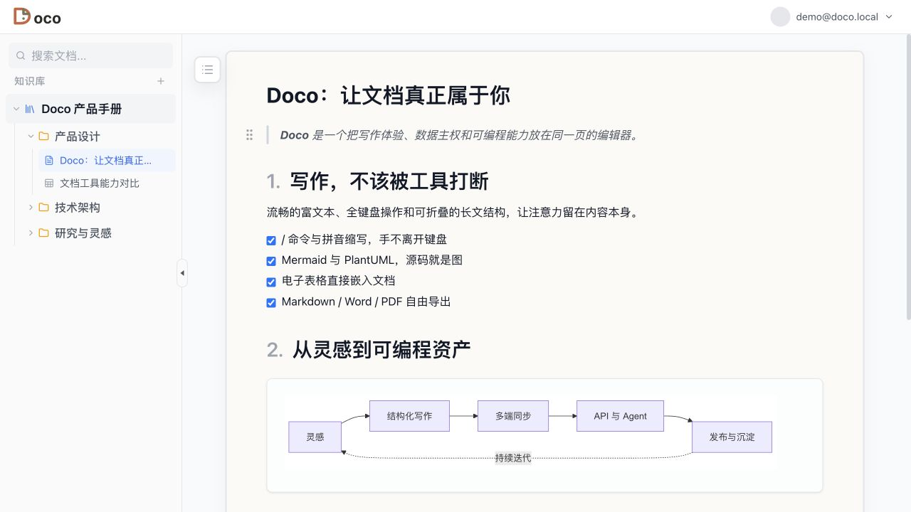

# Doco

> 📖 [中文版](README.zh-CN.md)

An open-source rich-text collaborative editor that puts your data back in your hands — real-time sync, knowledge base management, text-to-diagram, spreadsheets, and multi-format export.



## Features

### Editing Experience

- **Rich text editing**: headings, lists, blockquotes, task lists, code blocks (syntax highlighting), tables, images, links, text styling, and more
- **`/` slash command**: type `/` to open the command palette with fuzzy search — supports pinyin abbreviations for Chinese users
- **Floating toolbar**: auto-appears on text selection, all formatting actions within two centimeters of your cursor
- **Block drag-and-drop**: hover the left edge of any paragraph to reveal a drag handle — reorder content like building blocks
- **Collapsible sections**: fold away sections you're not working on; collapse state persists across sessions
- **Auto heading numbering**: one-click toggle — H1–H4 headings automatically maintain hierarchical numbering (`1.` `1.1` `1.1.1`)
- **Keyboard shortcuts**: `⌥↑/↓` move blocks, `⌘D` duplicate blocks, `⌘⌥1/2/3/0` switch heading levels

### Text-to-Diagram

Write Mermaid or PlantUML source code directly in your document. Diagrams render in place. Double-click to edit, fullscreen view, pinch-to-zoom — no more export-import-replace cycles with draw.io.

- **Mermaid**: flowcharts, sequence diagrams, class diagrams, Gantt charts, state diagrams, and more
- **PlantUML**: sequence diagrams, class diagrams, use case diagrams, component diagrams, and more

### Spreadsheet

A full spreadsheet engine embedded in your documents:
- Formula evaluation, cell formatting
- Freeze panes, sort & filter
- Cell merge / split
- CSV import / export

Use it inline as a content block, or pop it out as a standalone full-screen spreadsheet.

### Knowledge Base

- Knowledge Base → Folders (nestable) → Documents — a three-level structure
- Drag-and-drop reordering, renaming, and moving in the sidebar
- Whole-KB ZIP export preserving folder hierarchy, with bundled images

### Real-time Collaboration

Built on the Yjs CRDT algorithm:
- No save button — changes sync automatically
- Offline-first: browser IndexedDB is the primary store; the server holds a snapshot. Edit without a network, merge automatically when reconnected
- Seamless device switching: close your laptop, pick up your phone, keep writing

### Import / Export

| Format | Import | Export |
|--------|--------|--------|
| Markdown | ✅ Paste / file upload | ✅ Single doc & KB bundle |
| Word (DOCX) | ✅ | ✅ |
| PDF | ✅ | ✅ |
| HTML | ✅ | — |
| WeChat Official Account | — | ✅ (with theme preview) |
| Images (in-document) | ✅ (paste / drag-drop) | ✅ (bundled in ZIP) |

### API

A full REST API (OpenAPI 3.1 spec, Bearer Token auth, ETag versioning). Turn your docs into programmable assets — script your own backups, let an agent organize your knowledge base, pipe docs from your publishing workflow to your blog.

Built-in API documentation page, ready to use out of the box.

## Tech Stack

| Layer | Technology |
|---|---|
| Frontend Framework | React 18 + Vite + TypeScript |
| CSS | Tailwind CSS v4 |
| Editor | Tiptap v3 (ProseMirror) |
| Collaboration | Yjs (CRDT) + Hocuspocus |
| Diagrams | Mermaid + PlantUML |
| Backend | Node.js + Express + Hocuspocus Server |
| Database | better-sqlite3 (SQLite, WAL mode) |
| UI Components | Radix UI, Lucide React, Tippy.js |

## Quick Start

### Prerequisites

- Node.js >= 18
- pnpm

### Install & Run

```bash
# Install frontend dependencies
pnpm install

# Install backend dependencies
cd backend && npm install && cd ..

# Start the frontend dev server (Vite, default :5173)
pnpm run dev

# In another terminal, start the backend (Express + WebSocket, default :8000)
cd backend
npm run dev
```

Open `http://localhost:5173` — it will auto-connect to the backend WebSocket service.

### Build & Deploy

```bash
# Frontend build
pnpm run build          # output → dist/
pnpm run deploy         # deploy to Cloudflare Pages

# Backend (production)
cd backend
npm start
```

## Project Structure

```
doco/
├── src/
│   ├── main.tsx                      # App entry point
│   ├── App.tsx                       # Root component, routing, import/export
│   ├── components/
│   │   └── Sidebar.tsx               # KB sidebar (document tree)
│   └── editor/                       # Editor module
│       ├── index.ts                  # Entry, exports DocoEditor component
│       ├── DocoEditor.tsx            # Editor core (Yjs/Hocuspocus init, extension registration)
│       ├── types.ts                  # DocoEditor Props/Ref type definitions
│       └── components/
│           ├── BubbleMenu.tsx        # Selection floating toolbar
│           ├── BlockHandle.tsx       # Block drag handle
│           ├── SlashCommand.ts       # / command palette
│           ├── CommandList.tsx       # Command palette UI
│           ├── suggestions.ts        # Command menu data
│           ├── CollapseExtension.ts  # Block collapse extension
│           ├── DocSettings.tsx       # Document settings (heading numbering, background)
│           ├── MermaidBlock.ts       # Mermaid node definition
│           ├── MermaidComponent.tsx  # Mermaid renderer
│           ├── PlantUMLBlock.ts      # PlantUML node definition
│           ├── PlantUMLComponent.tsx # PlantUML renderer
│           ├── CalloutBlock.ts       # Callout block definition
│           ├── CalloutComponent.tsx  # Callout renderer
│           ├── SpreadsheetBlock.ts   # Spreadsheet node definition
│           ├── SpreadsheetComponent.tsx  # Spreadsheet renderer
│           ├── spreadsheetEngine.ts  # Spreadsheet calculation engine
│           ├── WeChatExportDialog.tsx # WeChat Official Account export
│           ├── KeyboardShortcuts.ts  # Keyboard shortcuts
│           ├── TableOfContents.tsx   # Table of contents
│           ├── CodeBlockComponent.tsx # Code block (highlight + copy)
│           └── ImageComponent.tsx    # Image renderer
├── backend/
│   ├── server.js                     # Entry: Express + Hocuspocus + export routes
│   ├── database.js                   # better-sqlite3 init & schema
│   ├── api.js                        # KB / folder / document REST API
│   ├── auth.js                       # Auth (OAuth + Email + API Token)
│   ├── markdown.js                   # YDoc → Markdown server-side export
│   ├── permissions.js                # Permission management
│   ├── quota.js                      # Quota management
│   ├── openapi.js                    # OpenAPI spec definition
│   └── tests/                        # Backend tests
└── docs/                             # Design docs & proposals
```

## Editor Component Usage

```tsx
import { DocoEditor } from './editor'
import type { DocoEditorRef } from './editor/types'

const editorRef = useRef<DocoEditorRef>(null)

<DocoEditor
  ref={editorRef}
  docId="doc-001"
  userId="user-001"
  collaboration={{
    websocketUrl: 'ws://localhost:8000',
  }}
  onTitleChange={(docId, title) => console.log('Title changed:', title)}
  placeholder="Start writing…"
/>

{/* Call export methods via ref */}
<button onClick={() => editorRef.current?.exportMarkdown()}>Export MD</button>
```

## Collaboration Architecture

```
Browser IndexedDB (y-indexeddb)  ← local primary store
       ↕
Browser Y.Doc  ← @hocuspocus/provider (WebSocket)
       ↕  Yjs binary delta messages
Server @hocuspocus/server  →  SQLite ydoc_state (one merged snapshot per doc)
```

- The browser IndexedDB is the primary store; the server snapshot is auxiliary. If the server snapshot is lost, simply open the document in the browser to repopulate it.
- Offline editing works seamlessly; changes sync automatically when the network returns.
- Collaborative cursors: supported by the framework, not enabled by default.

## Markdown Export

Both single documents and KB bundles support Markdown export, generated on-the-fly from YDoc on the server:

```bash
# Single document export
curl http://localhost:8000/api/docs/{id}/export.md

# KB ZIP bundle
curl http://localhost:8000/api/kb/{id}/export.zip
```

Custom nodes (Mermaid, PlantUML, Callout, etc.) have corresponding serialization rules in `backend/markdown.js`. When adding new custom nodes, update the server-side serializer accordingly.

## License

MIT
