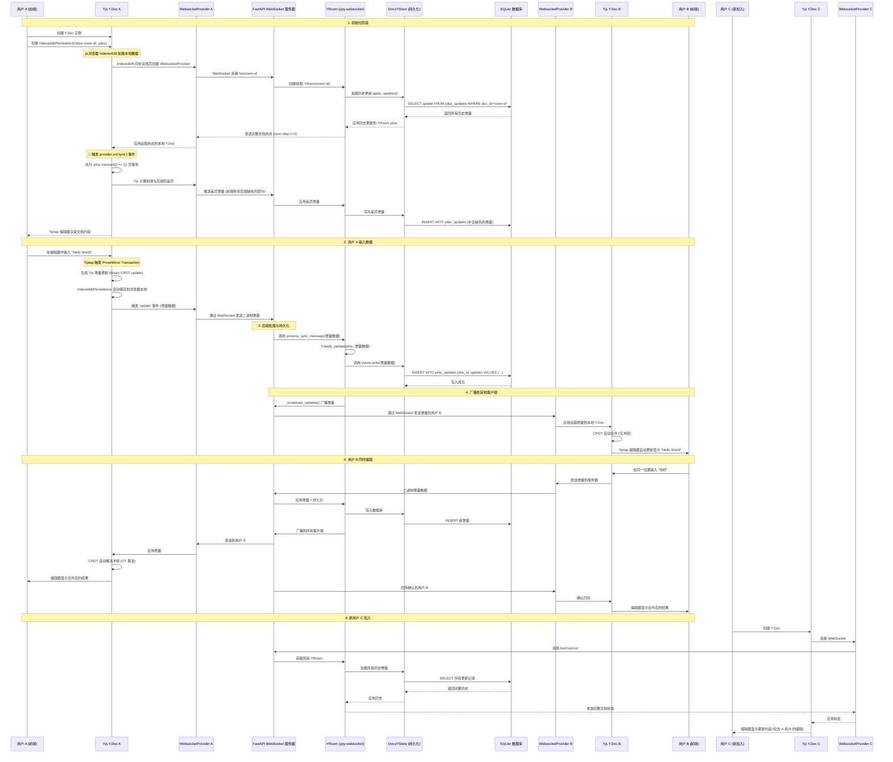

# Doco 协同编辑数据流程

本文档详细说明 Doco 编辑器中，用户输入的数据如何通过 Yjs CRDT 算法实现实时协同，从前端传输到后端存储，并同步到其他在线用户的完整过程。

---

## 核心技术栈

- **前端协同层**：Yjs (CRDT) + y-websocket (WebsocketProvider)
- **前端持久化**：y-indexeddb (IndexedDB 本地存储)
- **后端协同层**：ypy-websocket (WebsocketServer) + FastAPI
- **后端持久化**：SQLAlchemy + SQLite (YDocUpdate 表)
- **编辑器层**：Tiptap v3 + ProseMirror

---

## 数据流程序列图



---

## 关键实现细节

### 1. 前端 Yjs 初始化 ([DocoEditor.tsx:76-105](../src/editor/DocoEditor.tsx))

```typescript
// 1. 创建 Y.Doc 实例
const ydoc = useMemo(() => new Y.Doc(), [docId]);

// 2. 创建 WebsocketProvider (手动控制连接)
const provider = useMemo(() => {
  if (!collaboration) return null;
  return new WebsocketProvider(
    collaboration.websocketUrl,
    collaboration.roomName || docId,
    ydoc,
    { connect: false } // 等待 IndexedDB 加载完成
  );
}, [ydoc, docId, collaboration]);

// 3. IndexedDB 持久化 + WebSocket 连接
useEffect(() => {
  // 先从 IndexedDB 加载本地数据
  const idb = new IndexeddbPersistence(`doco-${docId}`, ydoc);
  if (!provider) return () => { idb.destroy() };

  // 等待 IndexedDB 同步完成后再连接 WebSocket
  idb.once('synced', () => {
    provider.connect();

    // WebSocket 连接成功后，触发空事务推送完整状态到后端
    const syncHandler = (isSynced: boolean) => {
      if (isSynced) {
        ydoc.transact(() => {}); // 触发同步
        provider.off('sync', syncHandler);
      }
    };
    provider.on('sync', syncHandler);
  });

  return () => {
    provider.disconnect(); // ⚠️ 不能用 destroy()
    idb.destroy();
  };
}, [provider, ydoc, docId]);
```

**关键点**：
- **IndexedDB 优先**：先加载本地数据，再连接 WebSocket
- **主动推送**：连接成功后触发空事务，让 Yjs 同步协议自动计算差异
- **Yjs 同步机制**：
  - 前端和后端各自维护一个状态向量 (State Vector)，记录每个客户端的操作时钟
  - 连接时双方交换状态向量，自动计算对方缺失的增量
  - `transact(() => {})` 触发状态向量对比，推送缺失部分
- **生命周期**：使用 `disconnect()` 而非 `destroy()`，避免 React 18 StrictMode 问题

### 2. 后端 WebSocket 路由 ([main.py:44-60](backend/main.py#L44-L60))

```python
# 路径提取：/ws/room-name → room-name
parts = self._websocket.url.path.strip("/").split("/")
room = parts[-1] if len(parts) > 1 else "default"

# 监控数据包大小
logger.info(f"[WS] Received {len(data)} bytes from {self.path}")
```

### 3. 持久化机制 ([main.py:80-95](backend/main.py#L80-L95))

```python
store = DocoYStore(room_name)
room = YRoom(ystore=store, ready=False)  # ready=False 防止加载时触发写入
await store.apply_updates(room.ydoc)      # 加载历史
room.ready = True                          # 开始监听新更新

# DocoYStore.write() 自动被 YRoom._broadcast_updates 调用
async def write(self, data: bytes) -> None:
    update = YDocUpdate(doc_id=self.doc_id, update=data)
    self.session.add(update)
    await self.session.commit()
```

### 4. CRDT 冲突解决

Yjs 使用 **CRDT (Conflict-free Replicated Data Type)** 算法：

- **无需中心化协调**：每个客户端独立生成操作 ID (client_id + clock)
- **自动合并**：相同位置的并发插入会根据 client_id 排序，保证最终一致性
- **因果关系保证**：通过向量时钟 (vector clock) 确保操作顺序

**示例**：
- 用户 A 在位置 5 插入 "Hello"
- 用户 B 同时在位置 5 插入 "你好"
- 合并结果：`"Hello你好"` 或 `"你好Hello"` (取决于 client_id 大小)

---

## 数据存储结构

### YDocUpdate 表 (SQLite)

| 字段 | 类型 | 说明 |
|------|------|------|
| id | INTEGER PRIMARY KEY | 自增 ID |
| doc_id | TEXT (索引) | 文档 UUID (房间名) |
| update | BLOB | Yjs 二进制增量数据 |
| created_at | DATETIME | 创建时间 |

**查询示例**：
```sql
-- 加载文档所有历史更新
SELECT update FROM ydoc_updates
WHERE doc_id = 'abc-123-def'
ORDER BY id ASC;
```

---

## 性能优化建议

1. **增量合并**：定期将多个小增量合并为快照，减少加载时间
2. **分页加载**：超大文档可分批加载历史更新
3. **压缩传输**：WebSocket 启用 permessage-deflate 压缩
4. **索引优化**：`doc_id` 字段已建立索引，确保查询性能

---

## 故障恢复机制

### 网络断线重连

```typescript
provider.on('status', (event: { status: string }) => {
  if (event.status === 'connected') {
    console.log('✅ 已连接到协同服务器');
  } else if (event.status === 'disconnected') {
    console.warn('⚠️ 连接断开，正在重连...');
  }
});
```

y-websocket 会自动重连，重连后：
1. 发送本地未同步的增量
2. 接收服务器端的新增量
3. CRDT 自动合并，无需手动处理冲突

### 数据丢失防护

- **前端**：IndexedDB 作为主存储 (y-indexeddb)
- **后端**：SQLite 作为备份存储
- **恢复**：前端打开文档时自动同步完整状态到后端

---

## 总结

Doco 编辑器通过 **Yjs CRDT + WebSocket** 实现了：

✅ **实时协同**：毫秒级延迟的多人编辑
✅ **离线支持**：断网后自动缓存，重连后同步
✅ **无冲突合并**：CRDT 算法自动解决并发编辑
✅ **持久化存储**：增量式存储，支持完整历史回溯
✅ **可扩展性**：房间隔离，支持数千并发文档

核心优势在于 **去中心化的冲突解决**，无需服务器端 OT (Operational Transformation) 算法，大幅降低了后端复杂度。
